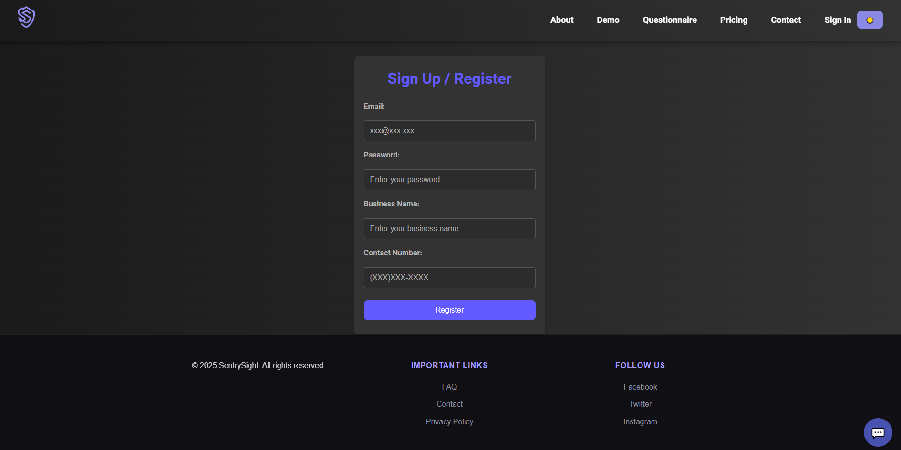
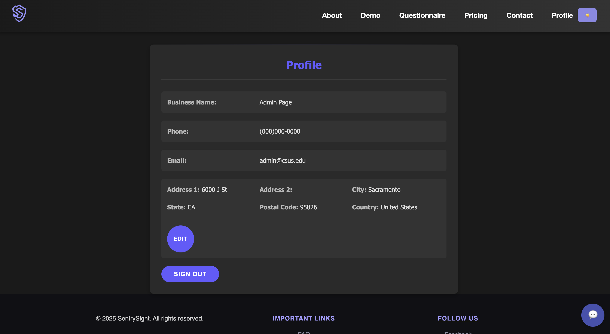

# Team TechSupport

**Members:**

* David Pham
* \[Name Placeholder]
* \[Name Placeholder]

**Client:** Ritchie Martinez

---

# SentrySight Website Development

*Developed by *TechSupport* for AI Firearm Detection Solutions.*


## Table of Contents

* [Project Overview](#project-overview)
* [Features](#features)
* [Prototype Images](#prototype-images)
* [Testing](#testing)
* [Deployment](#deployment)
* [Developer Instructions](#developer-instructions)
* [Entity-Relationship Diagram (ERD)](#entity-relationship-diagram-erd)
* [Timeline and Milestones](#timeline-and-milestones)
* [Contact](#contact)

## Project Overview

Our web development team was assigned to build a comprehensive website for **SentrySight**, a company specializing in real-time firearm detection using advanced AI technology. The website serves as an informational and interactive platform for businesses interested in enhancing their security measures through AI-driven solutions.

## Features

* **Responsive Design:** The website is fully responsive and accessible on various devices and screen sizes.
* **Informative Content:** Detailed pages about the company's services, technology, and benefits.
* **Interactive Questionnaire:** A survey for businesses to assess their current safety measures and interest in AI integration.
* **Demo Page:** Allows users to upload images to test the AI firearm detection system.
* **User Authentication:** Sign-in and login functionality with a user profile page.
* **Pricing Plans:** Overview of service packages with features and plan selection options.
* **FAQ Section:** Answers to common questions about the company's services and technology.

## Prototype Images

* **Main Page**

  

* **About Us Page**

  

* **Demo Page**

  

Product Testing 

* **Questionnaire Page**

  

* **Pricing Page**

  

* **Login/Register Page**

  



* **Profile Page**

  

## Testing

*This section will be developed in CSC 191.*

## Deployment

### AWS Lightsail Setup

1. **Create Ubuntu 20.04 LTS instance**
2. **Configure security for ports 3306 and 5173**
3. **Attach static IP**

### Installation Steps

```bash
# SSH into server
ssh -i your-key.pem ubuntu@your-instance-ip

# Clone repo
git clone https://github.com/jshingala/SentrySight.git
cd SentrySight/database/LightSail

# Install dependencies
npm install

# Create .env file with required variables

# Build application
npm run build

# Start with PM2
pm2 restart sentrysite
```

### Verification

* Access via instance IP
* Test core functionalities
* Create snapshot before major updates

### Backup

Ensure regular snapshots and off‑site backups are maintained before any major update or migration.

## Developer Instructions

This section is for anyone working on the SentrySight project and includes important notes on how to set up, run, and contribute to the codebase.

### Frontend Overview

The frontend is built with React and uses Vite as the build tool. All source code is located inside the src/ folder.

#### Key files and folders to know:

**App.jsx:** The main entry point of the app.

**Demo.jsx:** Handles image uploads and displays results from the AI.

**Questionnaire\_Client.jsx:** Displays the business safety questionnaire.

**Profile.jsx:** Allows users to update their business address.

Component-specific CSS files are used for styling (e.g., Footer.css, Header.css).

*Always pull the latest changes before working on new features.*

### To run the frontend locally:

**npm run dev** :
This will start the development server at [http://localhost:5173](http://localhost:5173).

### Backend Overview

Backend files are located inside the database/ folder. There are two versions:

EC2/server.js and server.py (for EC2 setup)

LightSail/server.js (for AWS Lightsail deployment)

### To run the backend locally, use:

node database/LightSail/server.js

*Make sure you have your .env file properly configured before starting the server.*

### Running Tests

Frontend tests are written using Jest and React Testing Library, and are located in src/**tests**/.

### To run tests:

npm run test

#### Follow these conventions:

Keep your branch names clear (e.g., feature/quiz-form, fix/navbar-bug).

Use consistent naming for your JSX and CSS files.

Use camelCase for variables

## Entity-Relationship Diagram (ERD)


## Timeline and Milestones

Our project timeline is managed through JIRA, outlining key milestones:

1. **Client Consultation (Sprint 1):**

   * Met with the client to understand their needs and objectives.
   * Gathered initial requirements and project scope.

2. **Planning and Design (Sprint 2):**

   * Created mockups of the website.
   * Developed tech stack to be used.
   * Developed ERD

3. **Development Phase (Sprint 3):**

   * Built the frontend using HTML, CSS, and React.
   * Integrated interactive elements like forms and upload features.
   * Backend development for user authentication

4. **Content Integration (Week 4):**

   * Added content provided by the client, including text and images.
   * Redesign Website UI with dark theme
   * Optimize the website to satisfy the remaining requirements

---

## Installation and Setup

#### Prerequisites

1. Install Node JS on your local machine
2. VS Code or any other similar IDE

#### Installation

3. Clone the repository to you local machine `https://github.com/jshingala/SentrySight.git`
4. Install the application dependencies `npm install`

#### Build the application

5. To build the application `npm run build`
6. To run the application `npm run start`

#### Output

##### [http://localhost:5173/](http://localhost:5173/)

## Setup

1. Clone the repository:
   Use Github Desktop

2. Navigate to the project folder:
   Make sure you're on the correct folder, use cd command.

3. Install dependencies:
   npm install

4. Run the development server:
   npm run dev (run npm start to also turn on the server)
