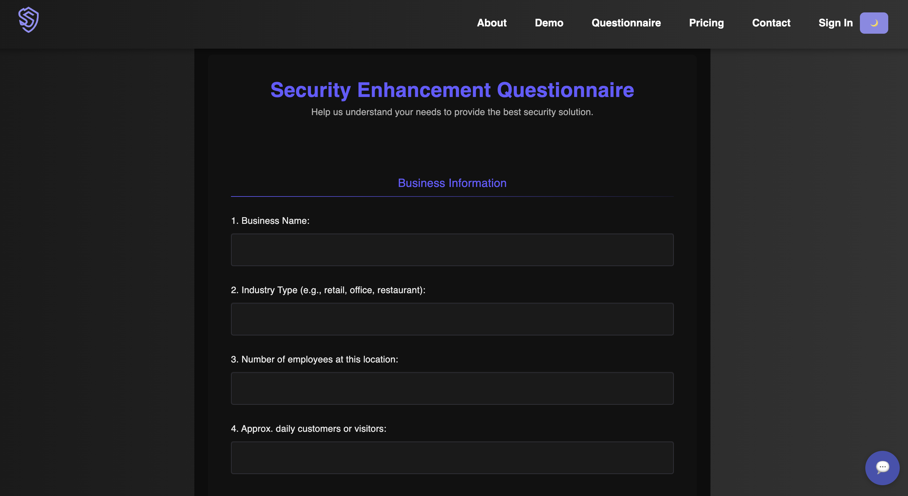
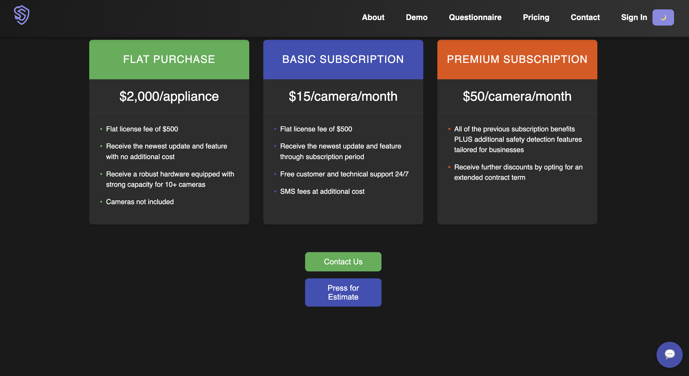

# SentrySight Website Development

*Developed by *TechSupport* for AI Firearm Detection Solutions.*

## Table of Contents

- [Project Overview](#project-overview)
- [Features](#features)
- [Prototype Images](#prototype-images)
- [Testing](#testing)
- [Deployment](#deployment)
- [Developer Instructions](#developer-instructions)
- [Entity-Relationship Diagram (ERD)](#entity-relationship-diagram-erd)
- [Timeline and Milestones](#timeline-and-milestones)
- [Contact](#contact)

## Project Overview

Our web development team was assigned to build a comprehensive website for **SentrySight**, a company specializing in real-time firearm detection using advanced AI technology. The website serves as an informational and interactive platform for businesses interested in enhancing their security measures through AI-driven solutions.

## Features

- **Responsive Design:** The website is fully responsive and accessible on various devices and screen sizes.
- **Informative Content:** Detailed pages about the company's services, technology, and benefits.
- **Interactive Questionnaire:** A survey for businesses to assess their current safety measures and interest in AI integration.
- **Demo Page:** Allows users to upload images to test the AI firearm detection system.
- **User Authentication:** Sign-in and login functionality with a user profile page.
- **Pricing Plans:** Overview of service packages with features and plan selection options.
- **FAQ Section:** Answers to common questions about the company's services and technology.

## Prototype Images

- **Main Page**

- **About Us Page**

- **Demo Page**

Product Testing

- **Questionnaire Page**

- **Pricing Page**

- **Login/Register Page**

- **Profile Page**

## Testing

*This section will be developed in CSC 191.*

## Deployment

*This section will be developed in CSC 191.*

## Developer Instructions

*This section will be developed in CSC 191.*

## Entity-Relationship Diagram (ERD)

## Timeline and Milestones

Our project timeline is managed through JIRA, outlining key milestones:

1. **Client Consultation (Sprint 1):**
   - Met with the client to understand their needs and objectives.
   - Gathered initial requirements and project scope.

2. **Planning and Design (Sprint 2):**
   - Created mockups of the website.
   - Developed tech stack to be used.
   - Developed ERD

3. **Development Phase (Sprint 3):**
   - Built the frontend using HTML, CSS, and React.
   - Integrated interactive elements like forms and upload features.
   - Backend development for user authentication

4. **Content Integration (Week 4):**
   - Added content provided by the client, including text and images.
   - Redesign Website UI with dark theme
   - Optimize the website to satisfy the remaining requirements

---
